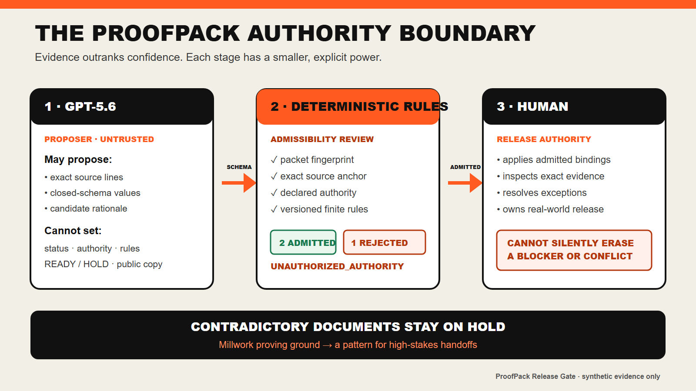

# The ProofPack Pattern

> **AI proposes. Deterministic rules judge admissibility. Humans keep release authority.**

ProofPack is a pattern for AI-era handoffs where confident language is not enough. An AI may propose narrowly typed links between a claim and exact source material. A deterministic reviewer then checks packet identity, anchor existence, declared authority, and a finite ruleset. Only admitted evidence can enter the ledger, and only the ledger can drive the machine gate. A person keeps responsibility for the real-world release.

Commercial millwork is the first proving ground because a proposal, architectural set, RFI, traveler, and approval register can disagree before an expensive physical object is fabricated. The bundled scenario is deliberately small and synthetic: it proves the control boundary, not universal document understanding or readiness for another regulated domain.

## The reusable control boundary

| Stage | May do | May not do |
| --- | --- | --- |
| AI proposer | Suggest a closed set of candidate bindings with exact quoted anchors. | Set authority, claim status, `READY`/`HOLD`, rules, or public output. |
| Deterministic reviewer | Validate packet identity, exact anchors, allowed values, source authority, and versioned rules. | Invent missing evidence or waive a failed rule. |
| Human release owner | Inspect the ledger, apply admitted evidence, resolve exceptions, and own the real-world decision. | Silently rewrite the evidence history or make a rejected model suggestion authoritative. |

## Pharma batch release

An AI could propose exact bindings from a bounded electronic batch record: a lot number, equipment-cleaning record, deviation disposition, laboratory result, or required signature. A deterministic reviewer would admit a binding only when the source version, exact field, signer role, chronology, and validated rule pack agree; a model's confident summary would never mark the batch releasable.

The evidence ledger could make missing review, conflicting lot identity, or an unresolved deviation visible before a qualified person releases the batch. This is an application hypothesis, not a validated pharmaceutical system: a real implementation would require domain owners, validated software controls, audit-trail requirements, and the applicable quality and regulatory framework.

## Aviation maintenance sign-off

An AI could propose candidate links among a work card, maintenance manual revision, serialized component record, inspection entry, and mechanic sign-off. Deterministic rules would check exact task references, current approved data, signer authorization, required independent inspections, and aircraft/component identity before admitting any evidence.

The ledger would keep an aircraft return-to-service gate on hold when a task is incomplete, an inspection authority is wrong, or two records refer to different revisions. A licensed human would retain return-to-service authority. This would need operator- and regulator-approved rule packs, security controls, and formal validation before operational use.

## Construction pay applications

An AI could propose exact bindings from a pay application, schedule of values, approved change order, field report, lien waiver, and architect certification. Deterministic checks would enforce contract identity, billing-period alignment, approved-change authority, arithmetic constraints, and the presence of required supporting documents.

The ledger could hold payment when an invoice includes an unapproved change, a waiver is stale, or claimed completion conflicts with the field record. The owner, architect, or other designated certifier would keep contractual release authority. A real deployment would need project-specific contracts, jurisdictional review, and carefully scoped financial controls.

## Why this is different

| Existing approach | Useful for | Failure mode ProofPack targets |
| --- | --- | --- |
| Spreadsheet or checklist | Shared visibility and manual coordination. | A checked box can lose its source, version, authority, and contradiction trail. |
| Generic document AI | Fast search, extraction, and summarization. | Fluent output can blur what was found, inferred, missing, or unauthorized. |
| Ordinary workflow approval | Routing a task to a named approver. | Approval routing does not itself prove that the underlying evidence is admissible or internally consistent. |
| ProofPack pattern | Evidence-bound release decisions in a constrained packet. | It deliberately trades open-ended understanding for transparent, reproducible admission and fail-closed behavior. |

## Unvalidated pilot hypothesis

The next honest step is a shadow-mode millwork pilot in which ProofPack never controls fabrication. It would compare a normal coordination review with the same review plus the evidence ledger.

| Pilot measure | Why it matters | Current evidence |
| --- | --- | --- |
| Contradictions surfaced before drawing release | Tests whether the gate catches the intended coordination failure. | Unmeasured outside the synthetic scenario. |
| Minutes from packet receipt to traceable handoff | Tests whether evidence lineage adds or removes coordination time. | Unmeasured. |
| Reviewer corrections to proposed bindings | Tests whether the AI proposal boundary is appropriately narrow. | Unmeasured. |
| Holds resolved without fabrication rework | Connects the workflow to physical-cost avoidance without claiming savings in advance. | Unmeasured. |
| Exception frequency and reason | Reveals where the ruleset is incomplete or operationally unrealistic. | Unmeasured. |

The pattern succeeds only if it makes uncertainty and authority boundaries easier to inspect without creating a false promise of automatic truth.
